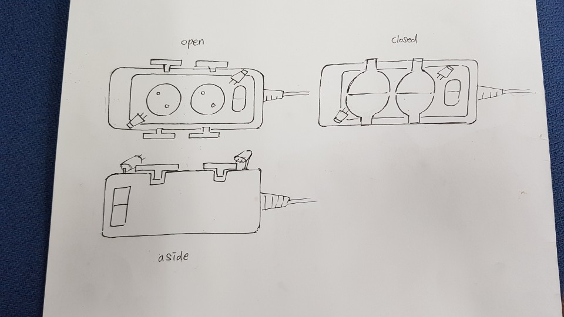
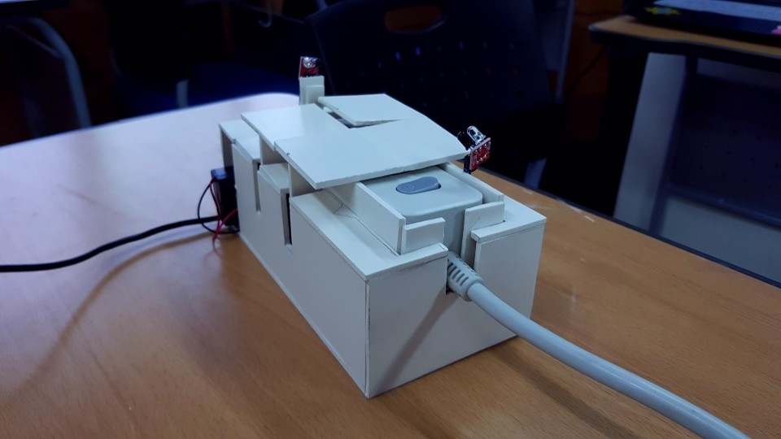
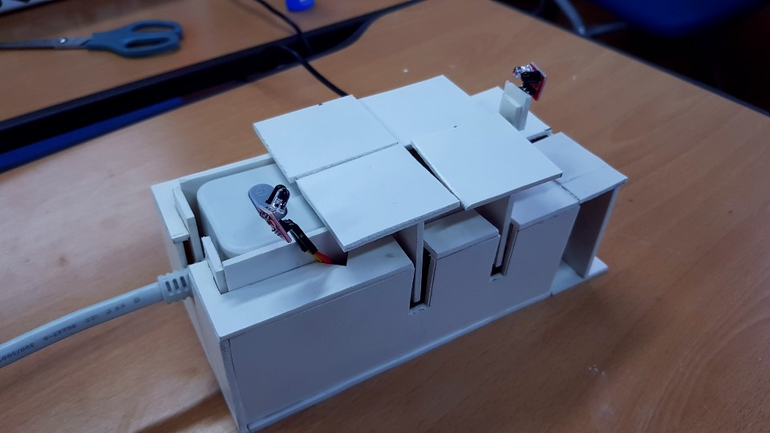

Creative Engineering Design - 2nd Grade major
==========
*****

### Project Group Members (+ github)

- [Junho-Yoon](https://github.com/J-hoplin1) : Hongik.Univ, Department of Software Engineering and Communication
- [Chansol-Park](https://github.com/PnutButter-Jelly) :  Hongik.Univ, Department of Software Engineering and Communication
- [Junseok-Jeong](https://github.com/dpan0883) : Hongik.Univ, Department of Software Engineering and Communication

(Readme Updated by Junho-Yoon(J-Hoplin))
****

### Problem Recognition

1. There are many fire accidents because of sparks in the multi-tab.
2. Junho-Yoon's cousin almost got electrocuted before because he tries to insert chopsticks into a outlet hole.

### Problem Definition(in regular order)

1. In some cases, a fire occurs on a multi-tab.


2. A spark from the multi-tab results in a fire.


3. The accumulated foreign substances and sparks on the multi-tab meet and catch fire.

4. The multi-tap socket-outlet structure makes it easy for foreign matter to accumulate.

Result : A machine will be designed to make it difficult for foreign matter to accumulate in the outlet.

### Conceptual Design

1. Lay down the multi-tab when not in use
    
    -   Advantage 
        -   You can block the dust by simply opening the multi-tab direction.
    - Disadvantage
        -   If several of the multiple spheres on the multi-tab are used, dust cannot be prevented.
2. Install a machine to clean the outlet on the multi-tab.
    -   Advantage
        -   Brush the dust regularly to make it clean.
    -   Disadvantage
        -   There are blind spots that cannot be cleaned by machines alone, and if malfunctioning, a bigger electric shock can occur.
3. Install a machine that covers the multi-tab outlet when it is empty.
    -   Advantage
        -   Only unused multi-tab prevents dust from piling up.
    -   Disadvantage
        -   Depending on the structure, the shape of the plug that can be plugged is limited.

As follows, we have made three conceptual designs. In conclusion, we decided to adopt number three.

### Our final Optimization of the idea

Result : **Let's create a machine that automatically covers multiple tabs.**
***
### Idea Sketch



### Realize an Idea

Parts used for making

1. SG-90 Mini Servo Motor(x4)
2. 4-Channel Infrared Proximity Line Sensor Module(x2)
3. 40 Pin Connector F-M 20cm (Female - Male), Jumper Cable / Jumper Line(x2)
4. Arduino-Uno R3(x1)
5. 9V BatteryHolder / Switch, Cover(x2)

### Final Version





### Video of our final result

[Click Here](https://youtu.be/jcQyMvbSevU)

### Arduino Code(Use Reference Ardino IDLE)

```C++
#include <Servo.h>
Servo sv1;
Servo sv2;
Servo sv3; 
Servo sv4;

int inf_1 = 12;
int inf_2 = 13;

int pos1 = 0;
int pos2 = 0;

void setup() {
  Serial.begin(9600);
  
  sv1.attach(4);
  sv2.attach(5);
  sv3.attach(6);
  sv4.attach(7);
  sv1.write(90);
  sv2.write(90);
  sv3.write(90);
  sv4.write(90);

  pos1 = 0;
  pos2 = 0;

  pinMode(inf_1,INPUT);
  pinMode(inf_2,INPUT);
}

void loop() {
  if(digitalRead(inf_1) == LOW){
    Serial.println("1번 적외선 감지");
    if(pos1==0){
      /*for(int i=0;i<=90;i+=5){
        sv1.write(90+i);
        sv2.write(90-i);
        delay(50);
      }*/
      sv1.write(180);
      sv2.write(0);
      pos1++;
      delay(500);
    }
    delay(500);
  }
  else if(digitalRead(inf_1) == HIGH){
    Serial.println("1번 적외선 미감지");
    if(pos1==1){
      sv1.write(90);
      sv2.write(90);
      pos1--;
    }
    delay(500);
  }
  if(digitalRead(inf_2) == LOW){
    Serial.println("2번 적외선 감지");
    if(pos2==0) {
      sv3.write(180);
      sv4.write(0);
      pos2++;
      delay(500);
    }
    delay(500);
  }
  else if(digitalRead(inf_2) == HIGH){
    Serial.println("2번 적외선 미감지");
    if(pos2==1){
      sv3.write(90);
      sv4.write(90);
      pos2--;
      delay(500);
    }
    delay(500);
  }
}
```
